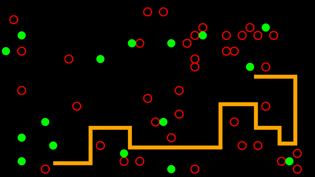

# Diplopod

A reimplementation of the classic snake clone '[Tausendfuß](https://archive.org/details/Tausendfuss_1983_TCS_Computer_DE)' from the [Colour Genie EG2000](https://en.wikipedia.org/wiki/Colour_Genie)

## Acknowledgements

This game owes a lot of ideas to the tutorial [Creating a Snake Clone in Rust, with Bevy](https://mbuffett.com/posts/bevy-snake-tutorial/).

Sound effects were obtained from https://www.zapsplat.com
